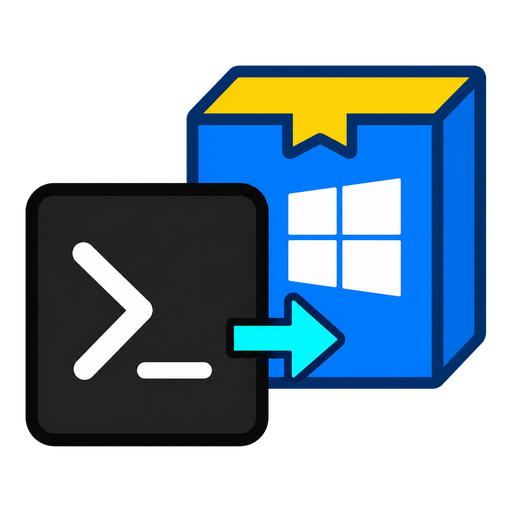

<p align="center">
  
</p>

<h1 align="center">BAT to EXE Chinese Enhanced</h1>

<p align="center">
  A maintainable, source-buildable Windows BAT/CMD packager with a Chinese GUI, system-tray runtime, local home-page detection, and process-tree cleanup.
</p>

<p align="center">
  <a href="./README.md">中文</a> ·
  <a href="#quick-start">Quick start</a> ·
  <a href="./docs/ARCHITECTURE.md">Architecture</a> ·
  <a href="./CONTRIBUTING.md">Contributing</a>
</p>

## What it does

The project embeds an existing `.bat` or `.cmd` script into a Windows x64 EXE. It is useful for local web services, development tools, operations scripts, and batch applications that need a tray controller.

It is not a script encryption tool. Generated executables still contain the original batch content, so never embed secrets in a script.

## Features

- Chinese WinForms user interface
- Drag-and-drop `.bat` / `.cmd` input
- Output file name synchronized with the application title
- Single-file generated EXE
- Optional system tray with rerun, stop, home page, logs, app directory, and exit commands
- Automatic local development-server home-page detection
- Windows Job Object process-group cleanup on tray exit
- Hidden execution with logs under `%LOCALAPPDATA%\BatToExeCn\Logs\`
- Custom `.ico` and administrator manifest support
- CLI automation mode

## Requirements

- Windows 10 or 11 x64
- .NET 9 SDK to build the converter
- The Windows .NET Framework 4.8 C# compiler

The built converter requires the .NET 9 Desktop Runtime. Generated executables run on the Windows .NET Framework runtime. Version 4.8 is the minimum supported baseline, 4.8.1 is compatible, and 4.7.x or earlier is outside the supported range.

If the converter cannot find `csc.exe`, install or repair .NET Framework 4.8 and verify one of these paths:

```text
C:\Windows\Microsoft.NET\Framework64\v4.0.30319\csc.exe
C:\Windows\Microsoft.NET\Framework\v4.0.30319\csc.exe
```

## Quick start

```powershell
git clone https://github.com/ITer99/BatToExeConverter.Cn.git
cd BatToExeConverter.Cn
dotnet build .\BatToExeConverter.sln -c Release
.\src\BatToExeConverter.Cn\bin\Release\net9.0-windows\BatToExeConverter.Cn.exe
```

You can also launch the project directly:

```powershell
dotnet run --project .\src\BatToExeConverter.Cn\BatToExeConverter.Cn.csproj
```

The current enhanced version is source-build first and does not yet provide a signed installer. Archived binaries do not represent the current source feature set.

## CLI

Invoking the DLL keeps progress output visible in the terminal:

```powershell
dotnet .\src\BatToExeConverter.Cn\bin\Release\net9.0-windows\BatToExeConverter.Cn.dll `
  --build .\samples\hello-world.bat `
  --output .\artifacts\hello-world.exe `
  --title "Hello World"
```

| Option | Description |
| --- | --- |
| `--build`, `--input`, `-i` | Input `.bat` or `.cmd` file |
| `--output`, `-o` | Output EXE path; defaults to the input file name |
| `--title`, `-t` | Application title |
| `--icon` | Custom `.ico` file |
| `--homepage`, `--home` | Explicit tray home-page URL |
| `--tray` | Enable system-tray mode |
| `--hidden` | Hide the batch window |
| `--admin` | Request administrator privileges |
| `--no-kill-on-exit` | Keep the script process group when the tray exits |
| `--help`, `-h` | Show help |

When no explicit home page is provided, only local addresses and common development-server patterns are detected. External documentation and download links are ignored.

Relative paths are normalized to absolute paths, missing output directories are created, and an existing output EXE is overwritten. Exit codes are `0` for success or help, `1` for generation or argument errors, and `2` when the input file is missing.

When `package.json` is inspected, only local URLs, port patterns, and known development-server commands are accepted. An external `homepage` field is not used as the tray home page.

## How generation works

1. Read and embed the batch script bytes in a generated C# runner.
2. Write a temporary source file, optional icon, and optional administrator manifest.
3. Compile an x64 WinExe with the Windows .NET Framework `csc.exe`.
4. At runtime, write a uniquely named temporary script and execute it through `cmd.exe`.
5. In tray mode, manage the script process group with a Windows Job Object.

Generation does not require NuGet and does not use `dotnet publish`.

"Single file" only means the original BAT/CMD is embedded. Node.js, Python, npm packages, `node_modules`, static web assets, configuration files, and other executables called by the script are not bundled and must still be deployed or installed.

At runtime the EXE writes a hidden, uniquely named BAT/CMD file. The next launch attempts to remove older scripts for the same application, but a script may remain after an abnormal exit. The app directory is preferred, with `%TEMP%\BatToExeCn\<AppId>\` as a fallback.

The working directory is always the generated EXE directory, so ordinary relative paths resolve from there. `%~dp0` points to the extracted script directory; in a read-only installation that can be the `%TEMP%` fallback rather than the EXE directory. Deploy companion resources beside the EXE and prefer ordinary relative paths when fallback behavior matters.

Explicitly terminating the Job force-terminates processes rather than requesting graceful shutdown. Normal descendants kept inside the Job are cleaned up; independent processes outside it are unaffected.

Tray mode always creates a process group. By default, tray exit force-terminates it. With `--no-kill-on-exit`, exit closes the management handle without termination, while the explicit Stop and Rerun commands still terminate the previous group to avoid duplicate services.

Generated executables currently do not forward their own command-line arguments to the embedded BAT/CMD. Normal mode returns the batch exit code; tray mode returns `0` after a normal exit. Interactive scripts should only be used with a visible window; hidden and tray scripts should be non-interactive.

## Repository layout

```text
src/BatToExeConverter.Cn/
├─ Assets/       Application icon
├─ Cli/          CLI parsing and entry flow
├─ Conversion/   Options, detection, and compiler pipeline
├─ Runtime/      Generated EXE runner template
├─ UI/           WinForms interface
└─ Program.cs    Application entry point
```

See [docs/ARCHITECTURE.md](./docs/ARCHITECTURE.md) for design details.

## Verification

```powershell
.\scripts\verify.ps1
```

The script builds the solution, checks CLI help, and generates an EXE from the included sample.

It supports Windows PowerShell 5.1 and PowerShell 7. It does not launch the GUI or execute the generated sample; tray interaction and live child-process cleanup require the focused checks described in [CONTRIBUTING.md](./CONTRIBUTING.md).

## Security and limitations

- Windows x64 output only
- No encryption, obfuscation, password protection, or antivirus bypass
- Only package scripts you trust
- Enable administrator mode only when the script genuinely requires it
- Security software may flag programs that extract scripts or launch child processes; use code review, signing, and trusted release channels

Read [SECURITY.md](./SECURITY.md) before reporting a vulnerability.

## History and license

The upstream repository contained a binary, README, and license but no maintainable source. The implementation under `src/BatToExeConverter.Cn/` is an independent source-based replacement and does not call the archived executable under `legacy/`.

Licensed under the existing [MIT License](./LICENSE).
